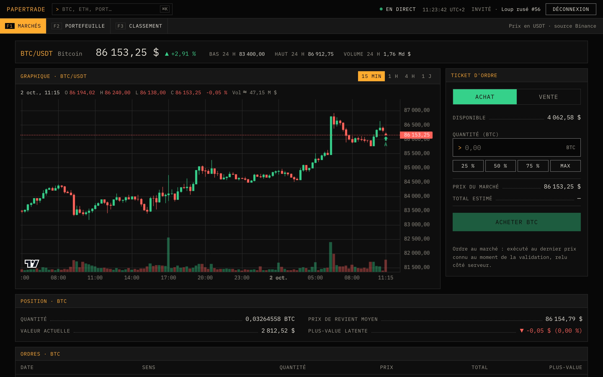
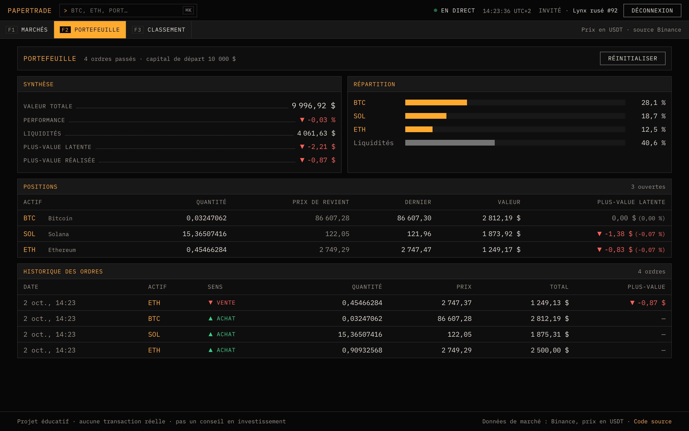
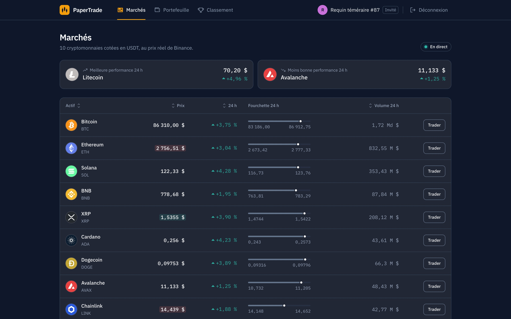

# PaperTrade : simulateur de trading crypto

Achetez et vendez des cryptomonnaies **au prix réel du marché** avec 10 000 $ fictifs, suivez
vos plus-values et comparez-vous aux autres joueurs. Aucun argent réel.

**Démo :** https://papertrade-five-peach.vercel.app



## Pourquoi ce projet

Je voulais m'entraîner sur Next.js et m'amuser sur un sujet qui m'intéresse : la finance. Un
simulateur de trading réunit les deux, avec des données en temps réel et des calculs où
l'exactitude compte, même quand l'argent est fictif.

## Fonctionnalités

- **Cours en temps réel** de 10 cryptomonnaies via le flux WebSocket public de Binance
- **Graphique en chandeliers** (15 min, 1 h, 4 h, 1 j) mis à jour en direct, avec vos achats et
  ventes affichés sur les bougies
- **Ordres au marché**, exécutés au prix relu côté serveur au moment de la validation
- **Portefeuille valorisé en direct** : prix de revient moyen, plus-values latentes et réalisées,
  répartition, historique des ordres
- **Classement** des joueurs, valorisé aux prix actuels
- **Compte invité en un clic**, connexion GitHub optionnelle : un invité qui se connecte avec
  GitHub conserve son portefeuille
- **Pensé pour le clavier** : ligne de commande (tapez `BTC` puis Entrée, ⌘K pour y accéder) et
  touches de fonction F1 à F3 pour changer d'écran



## Stack

| Domaine     | Outils                                                                                  |
| ----------- | --------------------------------------------------------------------------------------- |
| Framework   | Next.js 16 (App Router, Server Components, Server Actions), React 19, TypeScript strict |
| Interface   | Tailwind CSS 4, [Lightweight Charts](https://github.com/tradingview/lightweight-charts), IBM Plex Mono |
| Données     | PostgreSQL, Drizzle ORM, Zod                                                            |
| Auth        | Better Auth (compte invité, OAuth GitHub)                                               |
| Qualité     | Vitest (tests unitaires et d'intégration sur Postgres), ESLint, GitHub Actions          |
| Hébergement | Vercel + Neon (offres gratuites)                                                        |

## Design

Une interface de **terminal de marché** plutôt que d'application grand public : une seule police à
chasse fixe (IBM Plex Mono), des noirs neutres, l'ambre pour tout ce qui est interactif, le vert et
le rouge réservés aux variations. Pas d'arrondis ni d'ombres : des panneaux séparés par des filets.
Les choix et leurs raisons sont dans
[`design-system/papertrade/MASTER.md`](design-system/papertrade/MASTER.md).

- **Contrastes vérifiés** : chaque paire texte / fond dépasse 6:1 (WCAG AA demande 4,5:1).
- **Jamais la couleur seule** : hausses et baisses avec flèche et signe, légende O/H/L/C sous le
  graphique.
- **Clavier d'abord** : ligne de commande, touches de fonction, focus visible, lien d'évitement,
  tableau triable avec `aria-sort`, confirmations dans un `<dialog>` natif. Aucun raccourci à
  touche unique (WCAG 2.1.4).
- **Responsive** : vérifié de 375 px à 1 440 px.



## Choix techniques

### Le prix d'exécution ne vient jamais du navigateur

Le formulaire n'envoie que l'actif, le sens et la quantité. La Server Action
([`src/app/actions.ts`](src/app/actions.ts)) identifie l'utilisateur par sa session, valide
l'entrée avec Zod puis relit le prix chez Binance, sans cache, avant d'exécuter l'ordre. Modifier
la requête à la main ne permet donc pas d'acheter moins cher.

### Pas de double dépense

Chaque ordre s'exécute dans une transaction qui verrouille le portefeuille et la position
(`SELECT … FOR UPDATE`, voir [`src/lib/data/portfolio.ts`](src/lib/data/portfolio.ts)). Le test
d'intégration envoie **10 achats simultanés de 2 000 $ avec 10 000 $** : exactement 5 passent.
Sans le verrou, les 10 passent (vérifié en le retirant). Des contraintes `CHECK` en base
(liquidités ≥ 0, quantité > 0) servent de dernier filet de sécurité.

### Des montants exacts

En JavaScript, `0.1 + 0.2 !== 0.3`. Les montants sont donc stockés en `numeric(28, 8)` et calculés
avec decimal.js ([`src/lib/trading.ts`](src/lib/trading.ts)). Les arrondis se font au détriment du
joueur (coût d'achat arrondi au-dessus, produit de vente en dessous), comme sur une vraie
plateforme. Ces règles sont couvertes par des tests unitaires.

### Un seul WebSocket, des re-rendus limités

Toute l'application partage une connexion WebSocket
([`src/lib/price-store.ts`](src/lib/price-store.ts)). Elle s'ouvre quand un composant en a besoin,
se ferme quand plus personne ne l'écoute et se reconnecte avec une attente exponentielle. Les
mises à jour sont regroupées toutes les 500 ms et lues via `useSyncExternalStore` : un composant
ne se re-rend que si le prix de son actif a changé.

### Données externes validées

Les réponses de l'API Binance sont validées avec Zod avant usage, et mises en cache côté serveur
(10 s pour les prix, 30 s pour l'historique). Les prix servis par le serveur s'affichent dès le
premier rendu, puis le flux temps réel prend le relais.

### Comptes invités sans fuite

Un invité qui se déconnecte est supprimé. Une tâche planifiée Vercel
([`src/app/api/cron/cleanup/route.ts`](src/app/api/cron/cleanup/route.ts)) efface chaque nuit les
invités dont toutes les sessions ont expiré.

## Lancer le projet en local

Prérequis : Node.js 24 ou plus, et Docker.

```bash
npm install
cp .env.example .env.local   # puis renseigner BETTER_AUTH_SECRET (openssl rand -base64 32)
docker compose up -d         # Postgres sur le port 5433
npm run db:migrate
npm run dev                  # http://localhost:3000
```

| Commande              | Rôle                                                  |
| --------------------- | ----------------------------------------------------- |
| `npm run dev`         | Serveur de développement                              |
| `npm test`            | Tests unitaires et d'intégration (base Docker requise) |
| `npm run lint`        | ESLint                                                |
| `npm run typecheck`   | Vérification TypeScript                               |
| `npm run db:generate` | Génère une migration après modification du schéma    |
| `npm run db:migrate`  | Applique les migrations                               |
| `npm run db:studio`   | Explore la base dans Drizzle Studio                   |

## Déploiement gratuit sur Vercel

1. Poussez le projet sur GitHub.
2. Sur [vercel.com](https://vercel.com), cliquez sur **Add New → Project** et importez le dépôt.
   Next.js est détecté automatiquement.
3. Dans l'onglet **Storage** du projet, créez une base **Neon** (Postgres) dans la région
   _Frankfurt_ et connectez-la au projet : `DATABASE_URL` est ajoutée automatiquement.
4. Dans **Settings → Environment Variables**, ajoutez :
   - `BETTER_AUTH_SECRET` : générée avec `openssl rand -base64 32`
   - `CRON_SECRET` : générée avec `openssl rand -hex 16`
5. Lancez le déploiement. Les migrations s'appliquent pendant le build.

Pour activer la connexion GitHub (optionnel), créez une
[OAuth App](https://github.com/settings/developers) avec l'URL de callback
`https://<votre-projet>.vercel.app/api/auth/callback/github`. Ajoutez ensuite `GITHUB_CLIENT_ID` et
`GITHUB_CLIENT_SECRET`, puis redéployez.

Bon à savoir :

- [`vercel.json`](vercel.json) place les fonctions à Francfort (`fra1`), près de la base.
- L'offre gratuite de Neon met la base en veille quand elle n'est pas utilisée : la première
  visite après une pause est un peu plus lente.
- L'offre gratuite de Vercel (Hobby) est réservée à un usage non commercial, ce qui convient à un
  projet de portfolio.

## Structure

```
src/
├── app/                 Pages, Server Actions (actions.ts) et routes API
├── components/          Composants partagés : prix en direct, en-tête, historique…
└── lib/
    ├── trading.ts       Règles de calcul des ordres (tests unitaires)
    ├── data/            Accès aux données : ordres, portefeuille, classement
    ├── db/              Schéma Drizzle et connexion Postgres
    ├── binance.ts       API REST Binance (serveur)
    ├── price-store.ts   Flux WebSocket des prix (navigateur)
    └── auth.ts          Configuration Better Auth
design-system/           Design system (tokens, typographie, règles d'accessibilité)
drizzle/                 Migrations SQL générées
scripts/migrate.mts      Application des migrations (lancé au build)
```

## Avertissement

Projet éducatif : aucune transaction réelle n'est effectuée et rien ici ne constitue un conseil en
investissement. Données de marché fournies par Binance (prix en USDT, assimilés au dollar).
